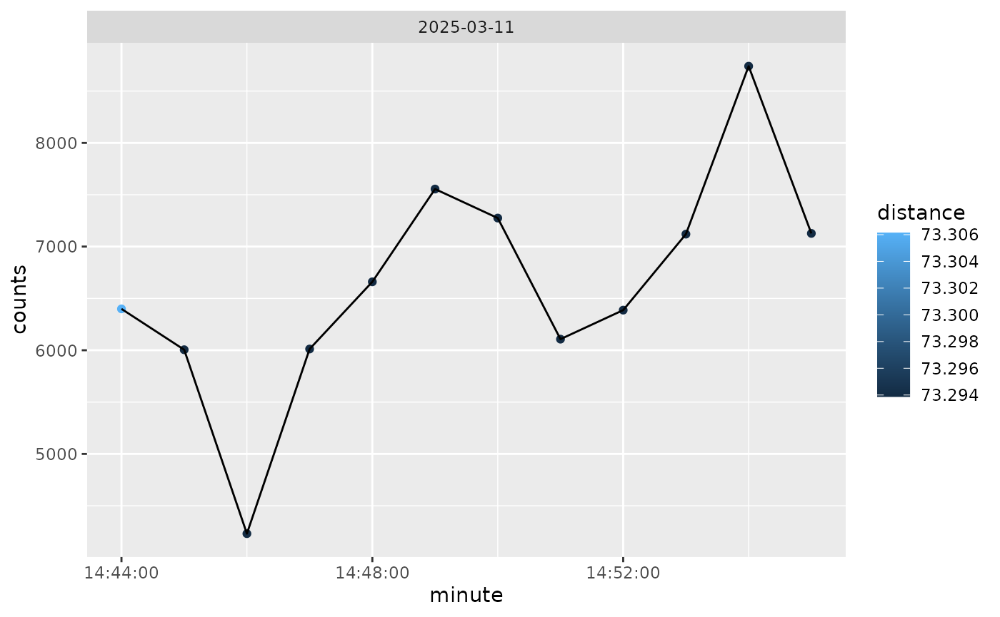

# Analysis of SensorLog and GT3X Data

## Introduction

In this vignette, we will go through the steps on how to analyze
SensorLog data. We will go through the steps of reading in the data,
checking for potential duplicates of timestamps, calculating distance
metrics from a fixed point (commonly participant home), and creating
daily summaries.

We will also integrate ActiGraph data to show activity at different
distances.

## Methods

### Data

The data used is example data embedded in the waterways package. It is a
single participant for approximately two hours worth of GPS and activity
data. The SensorLog data is stored in a zip file and contains a single
CSV file. The data is stored in the `extdata` folder of the package. We
can get the path of the file on each user’s machines using `system.file`
and the package name:

``` r
library(waterways)
file = system.file(
  "extdata", "SensorLogFiles_my_iOS_device_250311_14-55-58.zip",
  package = "waterways")
file
#> [1] "/home/runner/work/_temp/Library/waterways/extdata/SensorLogFiles_my_iOS_device_250311_14-55-58.zip"
```

This can also be done using the wrapper from `waterways`:

``` r
ww_example_sensorlog_file()
#> [1] "/home/runner/work/_temp/Library/waterways/extdata/SensorLogFiles_my_iOS_device_250311_14-55-58.zip"
```

#### Reading in the data

The data is read in using the `ww_read_sensorlog` function:

``` r
library(dplyr)
df = ww_read_sensorlog(file, robust = FALSE)
df = df %>% select(-file) # we don't need to see which file this came from
head(df)
#> # A tibble: 6 × 13
#>   time         index timestamp   lat   lon altitude speed speed_accuracy accel_X
#>   <chr>        <dbl>     <dbl> <dbl> <dbl>    <dbl> <dbl>          <dbl>   <dbl>
#> 1 2025-03-11T…     1    1.74e9  39.3 -76.6     46.3    -1             -1  0.411 
#> 2 2025-03-11T…     2    1.74e9  39.3 -76.6     46.3    -1             -1  0.0908
#> 3 2025-03-11T…     3    1.74e9  39.3 -76.6     46.3    -1             -1  0.125 
#> 4 2025-03-11T…     4    1.74e9  39.3 -76.6     46.3    -1             -1  0.0636
#> 5 2025-03-11T…     5    1.74e9  39.3 -76.6     46.3    -1             -1  0.0993
#> 6 2025-03-11T…     6    1.74e9  39.3 -76.6     46.3    -1             -1  0.0702
#> # ℹ 4 more variables: accel_Y <dbl>, accel_Z <dbl>, lat_zero <lgl>,
#> #   lon_zero <lgl>
```

The option `robust` will run `rewrite_sensorlog_csv` is run on the data.
The `rewrite_sensorlog_csv` attempts to fix any shifts with the data,
which have been seen due to a bug in the iOS app. The option default is
`FALSE` because this can take a much longer time to read in the data due
to reading and writing the data back out to a temporary file. This
function will also flag any values of latitude and longitude that are 0
(absolute value $< 0.00001$). This flag is created because the iOS app
will sometimes record 0 for latitude and longitude when the GPS signal
is lost.

We see that the data has the following columns, which are renamed from
the original data.

``` r
colnames(df)
#>  [1] "time"           "index"          "timestamp"      "lat"           
#>  [5] "lon"            "altitude"       "speed"          "speed_accuracy"
#>  [9] "accel_X"        "accel_Y"        "accel_Z"        "lat_zero"      
#> [13] "lon_zero"
```

The mapping from the new column names from the original column names can
be seen using `ww_sensorlog_csv_colnames_mapping`:

``` r
ww_sensorlog_csv_colnames_mapping()
#>                             time                            index 
#>               "loggingTime(txt)"               "loggingSample(N)" 
#>                        timestamp                              lat 
#> "locationTimestamp_since1970(s)"        "locationLatitude(WGS84)" 
#>                              lon                         altitude 
#>       "locationLongitude(WGS84)"            "locationAltitude(m)" 
#>                            speed                   speed_accuracy 
#>             "locationSpeed(m/s)"     "locationSpeedAccuracy(m/s)" 
#>                          accel_X                          accel_Y 
#>  "accelerometerAccelerationX(G)"  "accelerometerAccelerationY(G)" 
#>                          accel_Z 
#>  "accelerometerAccelerationZ(G)"
```

#### Processing the data

The data is then processed using the `ww_process_sensorlog` function.
This function (currently) will:

1.  Check the data for duplicated data using `ww_check_data`.
2.  Calculate distance from a central point if provided using
    `ww_calculate_distance`
3.  Process the timing data using `ww_process_time`, including checking
    for duplicate times. This function will also determine if the data
    is in the correct timezone by estimating the timezone expected (in
    the `expected_timezone` field, set to `America/New_York`) based the
    GPS coordinates, using the
    [`lutz::tz_lookup_coords`](http://andyteucher.ca/lutz/reference/tz_lookup_coords.md)
    function. If this check is not desired, set
    `expected_timezone = NULL`:

``` r
ww_process_sensorlog(df)
#> No duplicate combinations found of: time, timestamp, lat, lon, altitude, speed, speed_accuracy, accel_X, accel_Y, ... and 3 other variables
#> Error in `ww_check_data()`:
#> ! anyDuplicated(data$time) == 0 is not TRUE
```

As the error indicates, there are some duplicate times in this file. We
can look at those specific duplicate times and see that even to 3 digits
for milliseconds, there are multiple measurements:

``` r
df %>% 
  add_count(time) %>% 
  filter(n > 1) %>% 
  select(time, lat, lon, starts_with("accel"))
#> # A tibble: 8 × 6
#>   time                            lat   lon accel_X accel_Y  accel_Z
#>   <chr>                         <dbl> <dbl>   <dbl>   <dbl>    <dbl>
#> 1 2025-03-11T14:44:14.795-04:00  39.3 -76.6 -0.705    0.891  0.427  
#> 2 2025-03-11T14:44:14.795-04:00  39.3 -76.6 -1.02     0.667  0.405  
#> 3 2025-03-11T14:44:14.795-04:00  39.3 -76.6 -0.641    0.833 -0.0961 
#> 4 2025-03-11T14:44:14.796-04:00  39.3 -76.6 -0.989    0.441  0.0263 
#> 5 2025-03-11T14:44:14.796-04:00  39.3 -76.6 -0.808    0.591 -0.00647
#> 6 2025-03-11T14:44:14.796-04:00  39.3 -76.6 -0.213    0.354 -0.0787 
#> 7 2025-03-11T14:44:14.797-04:00  39.3 -76.6 -0.0179   0.432 -0.0820 
#> 8 2025-03-11T14:44:14.797-04:00  39.3 -76.6  0.0611   0.418  0.0770
```

Thus, we do not want to ensure no duplicated times, so we will set
`check_data` to be `FALSE`:

``` r
df_proc = ww_process_sensorlog(df, check_data = FALSE, apply_tz = TRUE)
df_proc
#> # A tibble: 11,578 × 18
#>    time                index timestamp             lat   lon altitude speed
#>    <dttm>              <dbl> <dttm>              <dbl> <dbl>    <dbl> <dbl>
#>  1 2025-03-11 18:44:11     1 2025-03-11 18:44:07  39.3 -76.6     46.3    -1
#>  2 2025-03-11 18:44:11     2 2025-03-11 18:44:07  39.3 -76.6     46.3    -1
#>  3 2025-03-11 18:44:11     3 2025-03-11 18:44:07  39.3 -76.6     46.3    -1
#>  4 2025-03-11 18:44:12     4 2025-03-11 18:44:07  39.3 -76.6     46.3    -1
#>  5 2025-03-11 18:44:12     5 2025-03-11 18:44:07  39.3 -76.6     46.3    -1
#>  6 2025-03-11 18:44:12     6 2025-03-11 18:44:07  39.3 -76.6     46.3    -1
#>  7 2025-03-11 18:44:12     7 2025-03-11 18:44:07  39.3 -76.6     46.3    -1
#>  8 2025-03-11 18:44:12     8 2025-03-11 18:44:07  39.3 -76.6     46.3    -1
#>  9 2025-03-11 18:44:12     9 2025-03-11 18:44:07  39.3 -76.6     46.3    -1
#> 10 2025-03-11 18:44:12    10 2025-03-11 18:44:07  39.3 -76.6     46.3    -1
#> # ℹ 11,568 more rows
#> # ℹ 11 more variables: speed_accuracy <dbl>, accel_X <dbl>, accel_Y <dbl>,
#> #   accel_Z <dbl>, lat_zero <lgl>, lon_zero <lgl>, distance <dbl>,
#> #   is_within_home <lgl>, distance_traveled <dbl>, timezone_estimated <chr>,
#> #   char_time <chr>
```

Note, the argument `apply_tz` will apply the time zone of the data. This
is helpful as it will set the correct time zone of the data in absolute
terms. Unfortunately, this makes it so researchers have to make sure
they time shift things like hours. For example, if you want to find what
data is between 10AM and 6PM in EST time zone, you need to shift those
to GMT/UTC. Also, this will cause issues as it shifts data into
different dates. The data is likely/sleep rest, but this can skew
numbers. For analysis, we will not apply the timezone:

``` r
df = ww_process_sensorlog(df, check_data = FALSE, apply_tz = FALSE)
df
#> # A tibble: 11,578 × 18
#>    time                index timestamp             lat   lon altitude speed
#>    <dttm>              <dbl> <dttm>              <dbl> <dbl>    <dbl> <dbl>
#>  1 2025-03-11 14:44:11     1 2025-03-11 18:44:07  39.3 -76.6     46.3    -1
#>  2 2025-03-11 14:44:11     2 2025-03-11 18:44:07  39.3 -76.6     46.3    -1
#>  3 2025-03-11 14:44:11     3 2025-03-11 18:44:07  39.3 -76.6     46.3    -1
#>  4 2025-03-11 14:44:12     4 2025-03-11 18:44:07  39.3 -76.6     46.3    -1
#>  5 2025-03-11 14:44:12     5 2025-03-11 18:44:07  39.3 -76.6     46.3    -1
#>  6 2025-03-11 14:44:12     6 2025-03-11 18:44:07  39.3 -76.6     46.3    -1
#>  7 2025-03-11 14:44:12     7 2025-03-11 18:44:07  39.3 -76.6     46.3    -1
#>  8 2025-03-11 14:44:12     8 2025-03-11 18:44:07  39.3 -76.6     46.3    -1
#>  9 2025-03-11 14:44:12     9 2025-03-11 18:44:07  39.3 -76.6     46.3    -1
#> 10 2025-03-11 14:44:12    10 2025-03-11 18:44:07  39.3 -76.6     46.3    -1
#> # ℹ 11,568 more rows
#> # ℹ 11 more variables: speed_accuracy <dbl>, accel_X <dbl>, accel_Y <dbl>,
#> #   accel_Z <dbl>, lat_zero <lgl>, lon_zero <lgl>, distance <dbl>,
#> #   is_within_home <lgl>, distance_traveled <dbl>, timezone_estimated <chr>,
#> #   char_time <chr>
```

The data times will be projected into the `GMT` timezone to agree with
the output from ActiGraph and
[`read.gt3x::read.gt3x`](https://rdrr.io/pkg/read.gt3x/man/read.gt3x.html).
**NOTE:** this shifts times from the original timezone. For example, if
the data was at “2025-03-25 14:14:00” with a timezone of `-04:00` then
the data will be in the `GMT` timezone, but the printed time will be
“2025-03-25 18:14:00 GMT”. You can set the timezone to the correct
timezone using
[`lubridate::with_tz`](https://lubridate.tidyverse.org/reference/with_tz.html)
or
[`lubridate::force_tz`](https://lubridate.tidyverse.org/reference/force_tz.html)
(they have different behavior).

You can also pass in the `tz = "EST"` argument to
`ww_process_sensorlog`, which is passed to `ww_process_time`. An
additional column of `char_time` is added so that the original character
values fo the time are retained so that users can check any timezone
conversions, as they can lead to issues with merging data, determining
windows (e.g. wake), or other time-based analyses.

``` r
df %>% 
  select(time, char_time, timestamp) %>% 
  head()
#> # A tibble: 6 × 3
#>   time                char_time                     timestamp          
#>   <dttm>              <chr>                         <dttm>             
#> 1 2025-03-11 14:44:11 2025-03-11T14:44:11.899-04:00 2025-03-11 18:44:07
#> 2 2025-03-11 14:44:11 2025-03-11T14:44:11.938-04:00 2025-03-11 18:44:07
#> 3 2025-03-11 14:44:11 2025-03-11T14:44:11.998-04:00 2025-03-11 18:44:07
#> 4 2025-03-11 14:44:12 2025-03-11T14:44:12.058-04:00 2025-03-11 18:44:07
#> 5 2025-03-11 14:44:12 2025-03-11T14:44:12.117-04:00 2025-03-11 18:44:07
#> 6 2025-03-11 14:44:12 2025-03-11T14:44:12.177-04:00 2025-03-11 18:44:07
```

#### Calculating distance

We did not pass in the latitude and longitude of a fixed point to
calculate distance for the processing function, but we could have. We
can also calculate the distance separately using the function
`ww_calculate_distance`. First, we need to get the latitude and
longitude of the fixed point. We can use the `tidygeocoder` package to
get the latitude and longitude of a fixed point. We will use the address
`615 N Wolfe St, Baltimore MD` for the Johns Hopkins Bloomberg School of
Public Health where this data was collected, using the [Census
Geocoder](https://geocoding.geo.census.gov/geocoder/) for free:

``` r
geo = tidygeocoder::geo("615 N Wolfe St, Baltimore MD", method = "census")
print(geo)
lat = geo$lat
lon = geo$long
```

    #> # A tibble: 1 × 3
    #>   address                        lat  long
    #>   <chr>                        <dbl> <dbl>
    #> 1 615 N Wolfe St, Baltimore MD  39.3 -76.6

We can also get Census-level information using:

``` r
if (rlang::is_installed("censusxy")) {
  df_census = data.frame(street = "615 N Wolfe St", 
                         city = "Baltimore", state = "MD",
                         zip = "21205") %>% 
    censusxy::cxy_geocode(
      street = "street",
      city = "city", 
      state = "state",
      zip = "zip",
      output = "full",
      return = "geographies",
      benchmark = "Public_AR_Current",
      vintage = "Census2010_Current")
  df_census
}
#>           street      city state   zip                          cxy_address
#> 1 615 N Wolfe St Baltimore    MD 21205 615 N Wolfe St, Baltimore, MD, 21205
#>   cxy_status cxy_quality                  cxy_matched_address cxy_tiger_line_id
#> 1      Match       Exact 615 N WOLFE ST, BALTIMORE, MD, 21205         206423761
#>   cxy_tiger_side   cxy_lon  cxy_lat cxy_state_id cxy_county_id cxy_tract_id
#> 1              R -76.59075 39.29762           24           510        60400
#>   cxy_block_id
#> 1         2002
```

From this, we can construct a 12-digits FIPS code or `GEOID10` which is
the census tract required for geocoding the EPA walkability index:

``` r
if (rlang::is_installed("arcgislayers") && rlang::is_installed("censusxy")) {
  df_census = df_census %>% 
    mutate(GEOID10 = ww_fips12(cxy_state_id, cxy_county_id, cxy_tract_id, cxy_block_id))
  epa_walkability = ww_epa_walkability(geoid = df_census$GEOID10)
  print(epa_walkability)
}
#> Registered S3 method overwritten by 'jsonify':
#>   method     from    
#>   print.json jsonlite
#> Simple feature collection with 1 feature and 183 fields
#> Geometry type: POLYGON
#> Dimension:     XY
#> Bounding box:  xmin: -8526057 ymin: 4763540 xmax: -8525672 ymax: 4764542
#> Projected CRS: WGS 84 / Pseudo-Mercator
#>        GEOID10      GEOID20 STATEFP COUNTYFP TRACTCE BLKGRPCE CSA
#> 1 245100604002 245100604002      24      510  060400        2 548
#>                                         CSA_Name  CBSA
#> 1 Washington-Baltimore-Arlington, DC-MD-VA-WV-PA 12580
#>                       CBSA_Name CBSA_POP CBSA_EMP CBSA_WRK Ac_Total Ac_Water
#> 1 Baltimore-Columbia-Towson, MD  2793250  1316328  1277911 46.28628        0
#>    Ac_Land  Ac_Unpr TotPop CountHU  HH P_WrkAge AutoOwn0   Pct_AO0 AutoOwn1
#> 1 46.28628 45.67526    850     601 513    0.769      207 0.4035088      160
#>     Pct_AO1 AutoOwn2p  Pct_AO2p Workers R_LowWageWk R_MedWageWk R_HiWageWk
#> 1 0.3118908       146 0.2846004     356          73         106        177
#>   R_PCTLOWWAGE TotEmp E5_Ret E5_Off E5_Ind E5_Svc E5_Ent E8_Ret E8_off E8_Ind
#> 1    0.2050562   2159      5     58      0   2055     41      5     58      0
#>   E8_Svc E8_Ent E8_Ed E8_Hlth E8_Pub E_LowWageWk E_MedWageWk E_HiWageWk
#> 1      5     41  2019      31      0         165         432       1562
#>   E_PctLowWage      D1A      D1B      D1C  D1C5_RET D1C5_OFF D1C5_IND D1C5_SVC
#> 1   0.07642427 13.15811 18.60964 47.26848 0.1094685 1.269834        0 44.99154
#>    D1C5_ENT  D1C8_RET D1C8_OFF D1C8_IND  D1C8_SVC  D1C8_ENT  D1C8_ED D1C8_HLTH
#> 1 0.8976413 0.1094685 1.269834        0 0.1094685 0.8976413 44.20336 0.6787044
#>   D1C8_PUB      D1D D1_FLAG D2A_JPHH D2B_E5MIX D2B_E5MIXA D2B_E8MIX D2B_E8MIXA
#> 1        0 60.42659       0 4.208577 0.1684239  0.1450724 0.1809233  0.1558933
#>   D2A_EPHHM D2C_TRPMX1 D2C_TRPMX2 D2C_TRIPEQ D2R_JOBPOP D2R_WRKEMP D2A_WRKEMP
#> 1 0.4211129  0.2334652  0.2599127  0.4008462  0.5649718  0.2831014  0.1648912
#>   D2C_WREMLX     D3A D3AAO    D3AMM    D3APO      D3B D3BAO   D3BMM3   D3BMM4
#> 1  0.4338273 33.5634     0 17.80826 15.75514 193.5917     0 27.65398 124.4429
#>     D3BPO3   D3BPO4    D4A    D4B025    D4B050   D4C      D4D        D4E   D5AR
#> 1 13.82699 41.48098 156.91 0.1005002 0.9287976 83.67 1156.904 0.09843529 172055
#>     D5AE   D5BR   D5BE         D5CR     D5CRI         D5CE     D5CEI
#> 1 135656 686993 455084 0.0008137066 0.8170607 0.0007229358 0.8138514
#>          D5DR     D5DRI        D5DE     D5DEI D2A_Ranked D2B_Ranked D3B_Ranked
#> 1 0.002455375 0.6867774 0.002324796 0.8559681          8          2         19
#>   D4A_Ranked NatWalkInd                                   Region Households
#> 1         20   14.66667 Baltimore-Columbia-Towson, MD Metro Area        498
#>   Workers_1 Residents Drivers Vehicles White Male Lowwage Medwage Highwage
#> 1       356       874  680.24      447   307  387      73     106      177
#>   W_P_Lowwage W_P_Medwage W_P_Highwage GasPrice   logd1a   logd1c logd3aao
#> 1  0.07642427   0.2000926    0.7234831      248 2.650287 3.876779        0
#>   logd3apo d4bo25 d5dei_1 logd4d UPTpercap B_C_constant B_C_male  B_C_ld1c
#> 1 2.818705      0       1      7        35     2.352128 0.121315 -0.327752
#>   B_C_drvmveh  B_C_ld1a B_C_ld3apo  B_C_inc1 B_C_gasp B_N_constant B_N_inc2
#> 1    -0.51647 -0.016259  -0.172378 -0.656324 0.006464     3.252959 0.091073
#>   B_N_inc3 B_N_white B_N_male B_N_drvmveh  B_N_gasp  B_N_ld1a  B_N_ld1c
#> 1 0.082466 -0.038257 0.113668   -0.192584 -0.004854 -0.214509 -0.214509
#>   B_N_ld3aao B_N_ld3apo B_N_d4bo25 B_N_d5dei B_N_UPTpc C_R_Households C_R_Pop
#> 1   0.079935   -0.18742  -0.513327  0.041535 -0.000446         239116  609032
#>   C_R_Workers C_R_Drivers C_R_Vehicles C_R_White  C_R_Male C_R_Lowwage
#> 1      249913    432662.6       219982 0.2749117 0.4696765   0.2358181
#>   C_R_Medwage C_R_Highwage  C_R_DrmV NonCom_VMT_Per_Worker Com_VMT_Per_Worker
#> 1   0.3586968    0.4054851 0.8894451              1.208178           6.123527
#>   VMT_per_worker VMT_tot_min VMT_tot_max VMT_tot_avg GHG_per_worker Annual_GHG
#> 1       7.331705    3.427387    151.4601    23.25904       6.532549   1698.463
#>   Shape_Length Shape_Area OBJECTID SLC_score                       geometry
#> 1     2777.492   312797.9   111077  97.36253 POLYGON ((-8526057 4764524,...
#>   cat_walk_index
#> 1    (10.5,15.2]
```

We can simply focus on the EPA walkability index, which is the
`NatWalkInd` column. We can also get the EPA walkability index category
breaks from the `cat_walk_index`:

``` r
if (rlang::is_installed("arcgislayers") && rlang::is_installed("censusxy")) {
  print(epa_walkability %>% 
          as.data.frame() %>% 
          select(NatWalkInd, cat_walk_index))
}
#>   NatWalkInd cat_walk_index
#> 1   14.66667    (10.5,15.2]
```

We can then calculate the distance from this fixed point using the
`ww_calculate_distance` function:

``` r
df = ww_calculate_distance(df,
                           lat = lat,
                           lon = lon)
```

This function uses the
[`geosphere::distm`](https://rdrr.io/pkg/geosphere/man/distm.html)
function to calculate the distance in meters from the fixed point. We
can see the new columns that were added to the data.

``` r
df %>% 
  select(time, char_time, lat_zero, lon_zero, distance)
#> # A tibble: 11,578 × 5
#>    time                char_time                     lat_zero lon_zero distance
#>    <dttm>              <chr>                         <lgl>    <lgl>       <dbl>
#>  1 2025-03-11 14:44:11 2025-03-11T14:44:11.899-04:00 FALSE    FALSE        73.4
#>  2 2025-03-11 14:44:11 2025-03-11T14:44:11.938-04:00 FALSE    FALSE        73.4
#>  3 2025-03-11 14:44:11 2025-03-11T14:44:11.998-04:00 FALSE    FALSE        73.4
#>  4 2025-03-11 14:44:12 2025-03-11T14:44:12.058-04:00 FALSE    FALSE        73.4
#>  5 2025-03-11 14:44:12 2025-03-11T14:44:12.117-04:00 FALSE    FALSE        73.4
#>  6 2025-03-11 14:44:12 2025-03-11T14:44:12.177-04:00 FALSE    FALSE        73.4
#>  7 2025-03-11 14:44:12 2025-03-11T14:44:12.236-04:00 FALSE    FALSE        73.4
#>  8 2025-03-11 14:44:12 2025-03-11T14:44:12.296-04:00 FALSE    FALSE        73.4
#>  9 2025-03-11 14:44:12 2025-03-11T14:44:12.356-04:00 FALSE    FALSE        73.4
#> 10 2025-03-11 14:44:12 2025-03-11T14:44:12.415-04:00 FALSE    FALSE        73.4
#> # ℹ 11,568 more rows
```

### Summarizing the Data

Now that we have the distance for each point in time, we can summarize
the data. In many cases, we do not need the data at a sub-second or
second-level. We can summarize the data at a daily level using the
`ww_summarize_sensorlog` function. This function will take the mean over
a period of seconds, usually 60:

``` r
df_min = ww_minute_sensorlog(df)
head(df_min)
#> # A tibble: 6 × 16
#>   time                max_speed   lat   lon speed accel_X accel_Y accel_Z
#>   <dttm>                  <dbl> <dbl> <dbl> <dbl>   <dbl>   <dbl>   <dbl>
#> 1 2025-03-11 14:44:00        -1  39.3 -76.6    -1 -0.0178   0.964  0.0182
#> 2 2025-03-11 14:45:00        -1  39.3 -76.6    -1 -0.0665   1.01   0.0577
#> 3 2025-03-11 14:46:00        -1  39.3 -76.6    -1 -0.0547   1.00   0.0250
#> 4 2025-03-11 14:47:00        -1  39.3 -76.6    -1 -0.0843   1.01   0.0450
#> 5 2025-03-11 14:48:00        -1  39.3 -76.6    -1 -0.0808   1.01   0.0468
#> 6 2025-03-11 14:49:00        -1  39.3 -76.6    -1 -0.0901   1.01   0.0411
#> # ℹ 8 more variables: distance <dbl>, is_within_home <lgl>,
#> #   distance_traveled <dbl>, vm <dbl>, enmo <dbl>, lat_zero <lgl>,
#> #   lon_zero <lgl>, in_sensorlog <lgl>
```

We can also summarize the data at a daily level using the
`ww_summarize_sensorlog` function:

``` r
df_sum = ww_summarize_sensorlog(df)
df_sum
#> # A tibble: 1 × 11
#>   date       n_minutes_with_distance sum_distance max_distance
#>   <date>                       <int>        <dbl>        <dbl>
#> 1 2025-03-11                      12         880.         73.3
#> # ℹ 7 more variables: n_minutes_with_distance_traveled <int>,
#> #   sum_distance_traveled <dbl>, mean_distance_traveled <dbl>,
#> #   n_distance_traveled <int>, time_within_home <int>, time_outside_home <int>,
#> #   time_missing_home <int>
```

One of the main issues with the daily level if you typically want to
cross-referene GPS with activity, so we will keep the data at a minute
level for now.

### Reading in the GT3X data

To summarize the activity profile for different levels of proximity to a
fixed point we will read in the GT3X data. This data was captured using
an ActiGraph (Pensacola FL) GT9X device. The data is stored in the
`extdata` folder of the package, similar to the SensorLog data. We get
the path via `ww_example_gt3x_file`:

``` r
file_gt3x = ww_example_gt3x_file()
file_gt3x
#> [1] "/home/runner/work/_temp/Library/waterways/extdata/TAS1H30182789_2025-03-11.gt3x.gz"
```

We can read in the data using the `read.gt3x` package, but waterways
wraps this using `ww_read_gt3x`.

``` r
ag_tz_applied = ww_read_gt3x(file_gt3x, verbose = FALSE, apply_tz = TRUE)
head(ag_tz_applied)
#>                  time      X     Y     Z
#> 1 2025-03-11 17:45:00 -0.270 0.910 0.352
#> 2 2025-03-11 17:45:00 -0.266 0.895 0.359
#> 3 2025-03-11 17:45:00 -0.270 0.887 0.375
#> 4 2025-03-11 17:45:00 -0.281 0.875 0.391
#> 5 2025-03-11 17:45:00 -0.289 0.863 0.406
#> 6 2025-03-11 17:45:00 -0.285 0.859 0.418
```

We can check the timezone of the data using the
[`lubridate::tz`](https://lubridate.tidyverse.org/reference/tz.html)
function:

``` r
lubridate::tz(ag_tz_applied$time)
#> [1] "GMT"
```

The `apply_tz` argument in `ww_read_gt3x` (by default) will find the
timezone in the header of the file, and apply it to the data. This is
done using the
[`lubridate::with_tz`](https://lubridate.tidyverse.org/reference/with_tz.html)
function. The timezone is stored in the header of the file, which can be
seen using the header attribute:

We can confirm this via the header:

``` r
header = attributes(ag_tz_applied)$header
header
#> GT3X information
#>  $ Serial Number     :"TAS1H30182789"
#>  $ Device Type       :"Link"
#>  $ Firmware          :"1.7.2"
#>  $ Battery Voltage   :"4.17"
#>  $ Sample Rate       :80
#>  $ Start Date        : POSIXct, format: "2025-03-11 13:45:00"
#>  $ Stop Date         : POSIXct, format: "1-01-01"
#>  $ Last Sample Time  : POSIXct, format: "2025-03-11 15:43:15"
#>  $ TimeZone          :"-04:00:00"
#>  $ Download Date     : POSIXct, format: "2025-03-11 15:43:15"
#>  $ Board Revision    :"8"
#>  $ Unexpected Resets :"0"
#>  $ Acceleration Scale:256
#>  $ Acceleration Min  :"-8.0"
#>  $ Acceleration Max  :"8.0"
#>  $ Sex               :"Male"
#>  $ Race              :"White / Caucasian"
#>  $ Limb              :"Wrist"
#>  $ Side              :"Left"
#>  $ Dominance         :"Non-Dominant"
#>  $ Subject Name      :"John"
#>  $ Serial Prefix     :"TAS"
header$TimeZone
#> [1] "-04:00:00"
```

The timezone is stored in the `TimeZone` field. So the data is in GMT,
but it is “correct” since this is the local time **projected** into GMT.
For example, if you measured data in a timezone of `-04:00` and
`read.gt3x` gave you a value of `2025-03-25 14:14:00`, then the *true*
time in GMT would be `2025-03-25 18:14:00`. Using `read.gt3x`, the time
incorrectly would be `2025-03-25 14:14:00 GMT`, but with `ww_read_gt3x`
it would be `2025-03-25 18:14:00 GMT`. This means that if you want
convert timezones, you will need to use
[`lubridate::with_tz`](https://lubridate.tidyverse.org/reference/with_tz.html)
or
[`lubridate::force_tz`](https://lubridate.tidyverse.org/reference/force_tz.html).

We will not apply the timezone information similarly as the SensorLog
for the same reasons we discussed above. We can read in the data without
applying the timezone, giving “incorrect” data but that can be merged
with SensorLog and does not shift times to different dates:

``` r
ag = ww_read_gt3x(file_gt3x, verbose = FALSE, apply_tz = FALSE)
head(ag)
#>                  time      X     Y     Z
#> 1 2025-03-11 13:45:00 -0.270 0.910 0.352
#> 2 2025-03-11 13:45:00 -0.266 0.895 0.359
#> 3 2025-03-11 13:45:00 -0.270 0.887 0.375
#> 4 2025-03-11 13:45:00 -0.281 0.875 0.391
#> 5 2025-03-11 13:45:00 -0.289 0.863 0.406
#> 6 2025-03-11 13:45:00 -0.285 0.859 0.418
lubridate::tz(ag$time)
#> [1] "GMT"
```

In ActiLife, the ActiGraph software, values of zero for all axes are set
to the last observation carried forward (LOCF). The `fill_zeroes`
argument will (by default) apply this. Also, when the data is read in
using `read.gt3x`: \> DateTimes are therefore represented as POSIXct
format with the ‘GMT’ timezone attribute, which is false; the datetime
actually represents local time.

We can calculate a number of summary measures from the acceleration. We
will calculate ActiGraph Activity Counts using the `agcounts` package.
We will use the `epoch = 60` to calculate the counts in 60-second
epochs. From these counts, we can estimate non-wear using the Choi (Choi
et al. 2011) algorithm, which we use from the `actigraph.sleepr`
package. The `ww_process_gt3x` will perform these operations together:

``` r
counts = ww_process_gt3x(ag, verbose = FALSE)
counts %>% 
  head()
#> # A tibble: 6 × 6
#>   time                axis1 axis2 axis3 counts wear 
#>   <dttm>              <dbl> <dbl> <dbl>  <dbl> <lgl>
#> 1 2025-03-11 13:45:00  1067  1225  1235   2041 TRUE 
#> 2 2025-03-11 13:46:00  1004   772  1048   1644 TRUE 
#> 3 2025-03-11 13:47:00   129    11   189    229 TRUE 
#> 4 2025-03-11 13:48:00  1541  1017  2129   2818 TRUE 
#> 5 2025-03-11 13:49:00   676   575   619   1082 TRUE 
#> 6 2025-03-11 13:50:00    72    79    68    127 TRUE
counts = counts %>% select(time, counts, wear)
```

#### Overlap with SensorLog data

The SensorLog data used was a subset of the data from the ActiGraph data
and multiple recordings were done. We can see the overlap by using the
`time` column is used to find the overlap.

``` r
data = counts %>% 
  mutate(in_counts = TRUE) %>% 
  full_join(df_min %>% 
              mutate(in_sensorlog = TRUE),
            by = join_by(time)) %>% 
  tidyr::replace_na(list(in_counts = FALSE, in_sensorlog = FALSE))
data = data %>% 
  filter(in_counts & in_sensorlog)
data
#> # A tibble: 12 × 19
#>    time                counts wear  in_counts max_speed   lat   lon speed
#>    <dttm>               <dbl> <lgl> <lgl>         <dbl> <dbl> <dbl> <dbl>
#>  1 2025-03-11 14:44:00   6399 TRUE  TRUE             -1  39.3 -76.6    -1
#>  2 2025-03-11 14:45:00   6005 TRUE  TRUE             -1  39.3 -76.6    -1
#>  3 2025-03-11 14:46:00   4231 TRUE  TRUE             -1  39.3 -76.6    -1
#>  4 2025-03-11 14:47:00   6012 TRUE  TRUE             -1  39.3 -76.6    -1
#>  5 2025-03-11 14:48:00   6660 TRUE  TRUE             -1  39.3 -76.6    -1
#>  6 2025-03-11 14:49:00   7555 TRUE  TRUE             -1  39.3 -76.6    -1
#>  7 2025-03-11 14:50:00   7275 TRUE  TRUE             -1  39.3 -76.6    -1
#>  8 2025-03-11 14:51:00   6107 TRUE  TRUE             -1  39.3 -76.6    -1
#>  9 2025-03-11 14:52:00   6387 TRUE  TRUE             -1  39.3 -76.6    -1
#> 10 2025-03-11 14:53:00   7120 TRUE  TRUE             -1  39.3 -76.6    -1
#> 11 2025-03-11 14:54:00   8740 TRUE  TRUE             -1  39.3 -76.6    -1
#> 12 2025-03-11 14:55:00   7127 TRUE  TRUE             -1  39.3 -76.6    -1
#> # ℹ 11 more variables: accel_X <dbl>, accel_Y <dbl>, accel_Z <dbl>,
#> #   distance <dbl>, is_within_home <lgl>, distance_traveled <dbl>, vm <dbl>,
#> #   enmo <dbl>, lat_zero <lgl>, lon_zero <lgl>, in_sensorlog <lgl>
```

Here we see for this data that there is complete wear:

``` r
all(data$wear)
#> [1] TRUE
```

Here we can look at the counts within “home”/work from those without
(there are none) coupled with the variant that takes into account wear
time:

``` r
data %>% 
  group_by(is_within_home) %>% 
  summarise(
    sum_counts = sum(counts),
    mean_counts = mean(counts),
    sum_counts_wear = sum(counts[wear]),
    mean_counts_wear = mean(counts[wear])
  )
#> # A tibble: 1 × 5
#>   is_within_home sum_counts mean_counts sum_counts_wear mean_counts_wear
#>   <lgl>               <dbl>       <dbl>           <dbl>            <dbl>
#> 1 TRUE                79618       6635.           79618            6635.
```

#### Getting Times

You can easily manipulate the time variables to get the date, hour, and
minute level data. Here is an example function
`create_date_hour_minute`. We recommend using the `hms` data type for
the hour and minute columns. since you many times want to plot the data
by hour/minute and facet by day:

``` r
create_date_hour_minute = function(data) {
  data = data %>%
    mutate(
      date = lubridate::floor_date(time, "1 day"),
      date = lubridate::as_date(date),
      hour = lubridate::floor_date(time, "1 hour"),
      hour = hms::as_hms(hour),
      minute = lubridate::floor_date(time, "1 minute"),
      minute = hms::as_hms(minute)
    )
}
```

Alternatively, if you group the data by participant, you can create an
observation `day` variable that puts data on the same per-person time
frame (time from start) versus calendar time:

``` r
create_day = function(data) {
  data = data %>%
    dplyr::mutate(
      day = as.numeric(difftime(date, min(date), units = "days") + 1)
    )
}
```

We can plot the counts over time, colored by within home/work (all is
within that):

``` r
if (rlang::is_installed("ggplot2")) {
  library(ggplot2)
  data %>% 
    create_date_hour_minute() %>% 
    ggplot(aes(x = minute, y = counts)) +
    geom_point(aes(colour = is_within_home)) + 
    geom_line() + 
    facet_wrap( ~ date)
}
```


And we can also color by distance from home, so not much difference
here:

``` r
if (rlang::is_installed("ggplot2")) {
  library(ggplot2)
  data %>% 
    create_date_hour_minute() %>% 
    ggplot(aes(x = minute, y = counts)) +
    geom_point(aes(colour = distance)) + 
    geom_line() + 
    facet_wrap( ~ date)
}
```



#### Estimating Wear Time

We can estimate wear time using the `wear` column from the ActiGraph
data. Here we will calculate the sum of the wear at each date:

``` r
data %>% 
  create_date_hour_minute() %>% 
  group_by(date) %>% 
  summarise(
    n = n(),
    n_wear = sum(wear),
    n_nonwear = sum(!wear)
  )
#> # A tibble: 1 × 4
#>   date           n n_wear n_nonwear
#>   <date>     <int>  <int>     <int>
#> 1 2025-03-11    12     12         0
```

Without regard to SensorLog data, we can calculate the wear time by
date. This is useful if you want to see how much data was collected on a
given day:

``` r
counts %>% 
  create_date_hour_minute() %>% 
  group_by(date) %>% 
  summarise(
    n = n(),
    n_wear = sum(wear),
    n_nonwear = sum(!wear)
  )
#> # A tibble: 1 × 4
#>   date           n n_wear n_nonwear
#>   <date>     <int>  <int>     <int>
#> 1 2025-03-11   118    118         0
```

Once this is calculated, you can exclude dates without insufficient wear
time (e.g. 95% of the day or 1368 minutes, or 10 hours of wear).
Different tasks require different criteria for wear time.

## References

Choi, Leena, Zhouwen Liu, Charles E Matthews, and Maciej S Buchowski.
2011. “Validation of Accelerometer Wear and Nonwear Time Classification
Algorithm.” *Medicine and Science in Sports and Exercise* 43 (2): 357.
